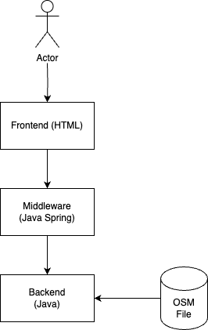
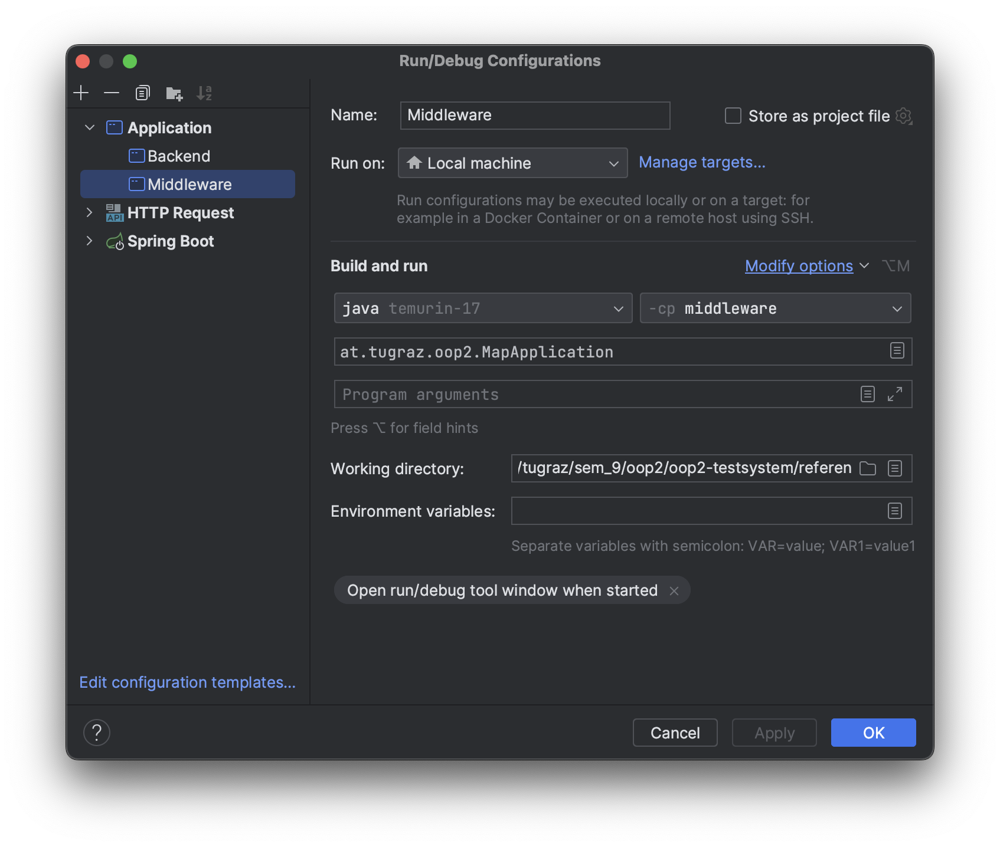
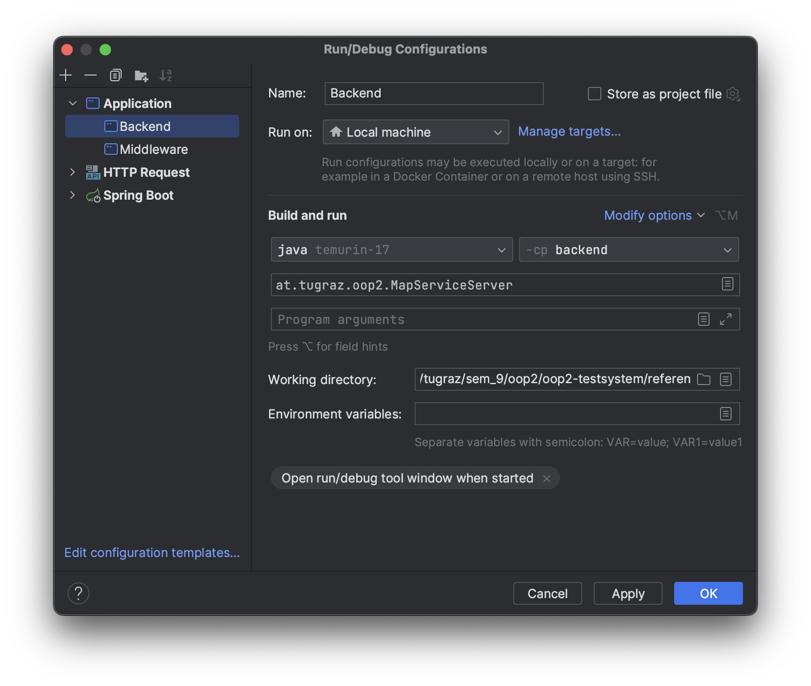

# Objektorientierte Programmierung 2 KU Assignment 2023

# Overview
<!-- Welcome to **OOP2 KU 2023**. -->
Here you find all necessary information for the **OOP2 KU 2023**. 

Your task will consist of *3 sub-assignments* that build on one another and finally result in a small, but quite useful **Geographic Information System** that serves data over a *Representational state transfer (REST)* interface. During this course you will learn about *modern Java principles*, and use a wide variety of libraries that we have already included for you. 

We first outline some important organisational information, then move on to a general overview of the requirements, and conclude with some tips on how to get started with IntelliJ and Docker.


# Important

You will work alone for the scope of *Assignment A0* and only your work will be considered for the final grading of this subtask. *Assignment A1* as well as *Assignment A2* will be carried out in groups, and you will be graded as a group (unless we notice that work was distributed unevenly among the team members). Your final grade will be based on the sum of *A0*, *A1*, and *A2*.

This year we have a very streamlined workflow, so make sure to stick to the given dates listed below:

## Timeline

* **Assignment A0**
  - Release: 5.10.2023
  - Deadline:  19.10.2023
  - Second-Chance Deadline: 26.10.2023

* **Group registration**
  - Start: 20.10.2023
  - End: 5.11.2023
  - Group Registration is done through TeachCenter

* **Assignment A1**
  - Start: 9.11.2023 (or when the repositories are released)
  - Deadline: no hard deadline for *A1* per se, but we recommend 20.12.2023; also remember that *A2* depends on *A1*!

* **Assignment A2**
  - Start: 9.11.2023 (or when the repositories are released)
  - Deadline: 11.1.2024 (*A1* + *A2*)
  - *Assignment interviews (AG)*: 15.-19.1.2024
  - Second-Chance Deadlines: 22.-26.1.2024 (depending on your *AG* date)

We will grade the most recent commit on your `main` branch before the deadline (midnight/23:59 at their respective dates), so there is no need for a tag/special branch!

## Requirements

* You are allowed to work in groups of up to **3** students. You should share the workload evenly across every student, and in the end every student is required to know everything about the entire submission.
* Plagiarism will not be tolerated
* Every student has to push to the git repository, working from one computer only is not in the spirit of the course.

## Team Registration

By the time A0 is handed in, you should have already formed teams of up to 3 students. Use TeachCenter to create your group. The teams stay the same throughout the course. Please tell us when a teammate drops out during the semester. Note that a grade is issued as soon as you register for a group on TC.


# Framework

## Logger

We have prepared a `MapLogger`-class with all-static methods in the `shared`-subproject. You are required to call the functions with the specified parameters, as you might not receive all points otherwise! Please consult us if you are not sure when/how to call these functions.

## Maven

We provide you with the properly set up Maven dependencies and projects, through which all necessary plugins and build routines should be covered.

## Frontend

While you can (and should!) test your responses using some REST-testing utility as outlined below, we provide you with a small frontend that should allow you to quickly check your responses and whether they make sense or work at all. You can start it easily using Docker Compose as described below.

# Assignments

We expect you to implement a RESTful API using the Spring Boot REST framework (you are not required to use the MVC pattern) as outlined below to build a simple, but versatile mapping service that is able to answer certain questions regarding road layouts, points of interests, a tile server as well as basic routing capabilities or landusage statistics. We furthermore expect you to route those requests to a backend using some protocol of your choice, like gRPC (this is already set up for you).

You will get data in the OpenStreetmap format (which is a XML-format) with some filtering applied and with some entries removed to make parsing a bit easier. The data is essentially a subset of the Styrian OpenStreetMap-data filtered down to just the roads, amenities and landusage in and around Graz. Further notes on how to parse it can be found in the A1 task description. We have also already included the popular Geospatial library [JTS](https://github.com/locationtech/jts/tree/master) as it is the de-facto standard for such applications in Java. We would highly recommend using it to process the geometric data provided to you.

> **Please note that we are using the word *road* for all entities that have the tag highway.**

This change of notation should encourage you to think about naming strategies/data transformations that can happen in the real world!

## Architecture

To give you a quick overview of the system you should design, an architecture diagram is provided:



## API design

We first want to outline how we want you to design the API as we will test on this *exact* specification like structure and naming of the variables, but in different ways throughout the course. We furthermore mark the requests using either *A0, A1,* or *A2* so that you know when to consider these specifications. Please consider also possible errors as described further down for the argument constraints!

**Please note that all `x`/`y` inputs have to be within the latitude/longitude bounds specified. Furthermore, sort the results by their respective ID's you find in the XML. This is required to keep paging consistent.** 


## Request: `GET /amenities` *[A0, A1]*

This request should return points of interest from a specified area or in the vicinity of a point.

*Parameters (either group `bbox.*` or `point.*` are mandatory!):*
* `amenity`: optional, can specify the type of amenity to return, if empty: return all types
* `bbox.tl.x`,`bbox.tl.y`: top-left of the bounding box to search for
* `bbox.br.x`,`bbox.br.y`: bottom-right of the bounding box to search for
* `point.x`,`point.y`: center of the point
* `point.d`: maximum distance to the point, in meters
* `take` (default: 50), `skip` (default: 0): optional parameters for paging, take is the limit, skip is how many you need to step over.

*Return format*:
see [responses](samples/RESPONSES.md)

## Request: `GET /amenities/{id}` *[A0, A1]*

This request will return all information that you can find in the provided dataset on this amenity, including the GeoJSON (!).

*Parameters:* None

*Return format*:
see [responses](samples/RESPONSES.md)

## Request: `GET /roads` *[A0, A1]*

This request should return roads, similar to the POI-request above. You need to, however, be able to find roads that are only intersecting with the bounding box at some edge too!

*Parameters:*
* `road`: optional, can specify the type of road to return, if empty: return all types
* `bbox.tl.x`,`bbox.tl.y`: top-left of the bounding box to search for
* `bbox.br.x`,`bbox.br.y`: bottom-right of the bounding box to search for
* `take` (default: 50),`skip` (default: 0): optional parameters for paging, take is the limit, skip is how many you need to step over.

*Return format*:
see [responses](samples/RESPONSES.md)

## Request: `GET /roads/{id}` *[A0, A1]*

This request will return all information that you can find in the provided dataset on this road, including some computed statistics like child IDs and the full GeoJSON (!) representation.

*Parameters:* None

*Return format*:

see [responses](samples/RESPONSES.md)

## Request: `GET /tile/{z}/{x}/{y}.png` *[A1]*

Here we require you to render map tiles for display on a map. We will focus mainly on drawing roads and land usage. To keep the map testable we need you to follow the colour scheme and widths outlined here. The stroke should be capped using `BasicStroke.CAP_BUTT` and joined using `BasicStroke.JOIN_ROUND`. The images should be 512x512 pixels in the PNG format.

**Layers:**

* background: white (`rgb(255,255,255)`), always displayed

Roads (highways):
* motorway: red (`rgb(255,0,0)`), 3px wide
* trunk: darkorange (`rgb(255,140,0)`), 2px wide
* primary: orange (`rgb(255,165,0)`), 2px wide
* secondary: yellow (`rgb(255,255,0)`), 2px wide
* road: darkgray (`rgb(128,128,128)`), 2px wide (everything tagged with highway, even the above categories)

Landusages (usually polygons or multipolygons):
* forest: `rgb(173,209,158)`
* residential: `rgb(223,233,233)`
* vineyard: `rgb(172,224,161)`
* grass: `rgb(205,235,176)`
* railway: `rgb(235,219,233)`


Nature:
* water `rbg(0,128,255)` (any entity with key `water`)

*Parameters:* 
* `layers` (default: `motorway`): comma-separated list of layers to display, these should be drawn in the order specified (the last one is drawn last)

*Return format*:
A `PNG`, indicated by the `Content-Type`-Header.

## Request: `GET /route` *[A2]*

This request will request a route from the with ID `from` to the node with ID `to`.

*Parameters:*
* `from`: start node ID
* `to`: end node ID
* `weighting`: either `time` or `length`, see below for more information (default: `length`)

*Return format*:

see [responses](samples/RESPONSES.md)

## Request: `GET /usage` *[A2]*

This request should return landusage statistics based on the provided bounding box.

*Parameters:*
* `bbox.tl.x`,`bbox.tl.y`: top-left of the bounding box to calculate the usage for
* `bbox.br.x`,`bbox.br.y`: bottom-right of the bounding box to calculate the usage for

*Return format*:
see [responses](samples/RESPONSES.md)

## Assignment 0 (20P)

This assignment is intended to give you a first look at the Spring Boot Framework and Java Classes. 
### Mock responses (16P)

You have to implement all the requests marked as *A0* only as far as returning dummy data, but in the correct format as outlined in [responses](samples/RESPONSES.md). You do not need to implement any data loading, error handling or communication with the backend for now. 

### Environment argument handling (4P)

Besides the responses, we need you to load, parse, store and use (only the port number of the middleware for *A0* though) the following environment variables (and log them correctly!). If they are not valid or not set, please revert them to the defaults.

On the middleware:
* `JMAP_MIDDLEWARE_PORT`: the integer port number of the RESTful-API. (default: `8010`)
* `JMAP_BACKEND_TARGET`: the `address:port` combination of the backend target. Can be taken as-is (no parsing required!, still revert to the default if missing). (default: `localhost:8020`)

On the backend:
* `JMAP_BACKEND_PORT`: the integer port number of the backend service (see later). (default: `8020`)
* `JMAP_BACKEND_OSMFILE`: the file to load the OpenStreetMap data from. You are allowed to stop the backend if the file is not existent  (default: `data/styria_reduced.osm`)

Please note that you might lose points if this is not implemented properly, as we rely on these settings for some tests - please look at the relevant Logger functionality! (see the [docker configuration](docker-compose.yml))

## Assignment 1 (50P)

This assignment should give you a good understanding of Spring Boot, Server-Client communication, data parsing and basics of geospatial data processing.

### Error Handling (10P)

You should return a simple error response in the Spring Boot service as JSON as outlined in [responses](samples/RESPONSES.md), where you indicate by the use of the status code the error you encountered. These are:
* `400` for missing or invalid parameters or invalid combinations of parameters
* `500` for any internal issues, i.e. cannot reach the backend.
* `404` if the entity requested could not be found

### Data Loading (10P)

The next task is to load the provided OSM-file, which you can download directly from the [TeachCenter](https://tc.tugraz.at/main/mod/resource/view.php?id=378614). First, you need to load all the nodes (type `node`) (please note that the Longitude is the X-Coordinate and the Latitude the Y-Coordinate), while saving the tags in some (hash-)map, with the key being `k` and the value being `v`.

Next, you should load the ways (type `way`), which consists of multiple nodes. These have references for nodes, which have to be resolved and have to be converted to Line Strings. If these are closed and have more than two points, these have to converted to polygons. The tags have to be handled the same way as in the nodes. If you do not find a node that is referenced by the way you can just ignore it.

The last type to load are the relations (type `relation`), where these are to be handled in a very specific way. This [article has some great illustrations](https://wiki.openstreetmap.org/wiki/Relation:multipolygon) of edge cases. However, to make it easier for you we provide you with pseudocode (note: the members of the relation can be fetched in a similar fashion to the ways, and you can ignore ways if they are not present):

```python
# this method only builds the JTS geometry for relations!
def buildGeom(members:list, tags: dict{str,str}) -> GeometryCollection:
  if "multipolygon" in tags:
    multi_polygons=[]
    inners=[]
    outer=None
    for(i=0; i<members.lenght;):
      closed_circle=getNextClosed(i, members) 
      # getNextClosed greedily iterates through the next members of 
      # the *same* type and builds the next closed polygon by 
      # iterating through all next referenced ways (and trying the
      # reversed ones too!) and combining them into a ring - if they 
      # form a closed one, the Polygon is finished 
      # (should work for **all** relations!)

      if closed_circle:
        if closed_circle.last_role=="outer":
          if outer:
            multi_polygons+=[buildMultipolygon([outer, ...inners])] #multipolygons usually have the first ring as the outer one
            inners=[]
          outer=closed_circle.polygon

        elif closed_circle.last_role=="inner":
          inners+=[closed_circle.polygon]

        i=closed_circle.last_member_idx+1
      else
        raise error
    # if there is still a an outer ring pick it up and add it
    if outer:
      multi_polygons+=[buildMultipolygon([outer, ...inners])] 
      inners=[]
    return buildGeometrycollection(multi_polygons)
  else:
    return buildGeometrycollection(members)
    # just multiple geometries
```
Please note that the following tasks are highly dependent on this task, so make sure to properly implement the loading phase. Make sure that the loading is complete in about 5 seconds. You are allowed to shut the backend down if the XML is malformed (the provided OSM-File should work!) or not present. You are free to use any XML-parser of your choice, but recommend simply using the Java-Extension package (`javax.xml.parsers.*`). For information on how to interact with JTS see [examples](https://github.com/locationtech/jts/blob/master/modules/example/src/main/java/org/locationtech/jtsexample/geom/BasicExample.java) or the [documentation](https://locationtech.github.io/jts/javadoc/)


## Communication with the backend

This subtask is up to you, just make sure that you are able to handle disconnects, missing backends and so forth. We recommend either using gRPC, as it is already set up in the `shared`-subproject and we will cover it in the lecture. You are, however free to use another RESTful-service, plain Java Sockets or any other form of communication, as long as it works using the network in the provided `docker-compose`! We will not award extra points for this task, as all other further tasks are not possible without this communication system - and take the additional overhead into account. We furthermore do not test on specifics, as we want to give you freedom in designing the way you communicate between systems yourself!

## Amenity & Road requests (20P)

For this task you are required to implement the four requests for amenities and roads. The geometric boundaries should be determined by intersecting the appropriate shapes using the JTS package. The distance should be calculated by transforming all possible targets and the query from `EPSG:4326` to `EPSG:31256`. Afterwards you simply can call `.distance(other)` on the geometry to determine and threshold the distance. See [this document](https://github.com/geotools/geotools/blob/main/docs/user/library/referencing/crs.rst) for more information. Nevertheless, this is the snippet you can use directly (please create the transform only once):
```java
CoordinateReferenceSystem sourceCRS = CRS.decode("EPSG:4326");
CoordinateReferenceSystem targetCRS = CRS.decode("EPSG:31256");
MathTransform transform = CRS.findMathTransform(sourceCRS, targetCRS, true);
//...
var geometryLocal=geometry.transform(transform);

```

## Mapping requests (10P)

The next task is to render the tiles to a PNG-file. You have to adhere to the colour scheme outlined in the specification, but you are free to add more layers if you like!

For calculating the latitude/longitude from the tile numbers in the request take a look at the [wiki](https://wiki.openstreetmap.org/wiki/Slippy_map_tilenames#Java). Please note that you have to add 10% of the width/height of the tile in each direction as you will otherwise miss some edge cases!

## Assignment 2 (30P)

This task is concerned with further functionality building upon the knowledge and problem-solving skills you should have learned in A1. Both tasks have a slight *algorithmic* touch.

### Routing (20P)

This task requires you to implement the endpoint `/route`, where you have to find the shortest path using the Dijkstra-algorithm. We have already included the [geotools-graph](https://docs.geotools.org/latest/userguide/extension/graph/index.html#graph-model) library which you are allowed to use - if you want to implement you own algorithm (i.e. A* or your own Dijkstra-implementation), feel free to do so!

You will either weigh your graph using the time it takes to travel the road or the length of the road, depending on the parameter passed by the request. Both should be determined using the transformed geometry from above, as you will receive the correct length in meters from that. The time can be calculated using the `maxspeed`-tag, which you can set to 30 km/h if not present or invalid as the dataset is only in Graz which has this limit on most roads. You have to calculate the time in minutes as this is the time you will return on the request when tallying it up.

The graph itself should only consist of ways with the tag `highway`, where each of them is an edge and the nodes at the ends are also nodes within the graph. It would be possible to include all nodes and connect them using smaller edges, but this is computationally a lot more expensive, so we discourage this approach.

Besides the computationally correct implementation we also want you to consider invalid requests with the following status codes again:
* `400` for missing/invalid parameters (the weighting should be set to the default and is thus excluded from this error) or no route found
* `404` if one of the nodes is not present in the graph

### Usage (10P)

Here you should implement the endpoint `/usage` which should return the percentage and area used by different landusage types. To accomplish this, you will first need to convert the areas of these from `EPSG:4326` to `EPSG:31256` (as above, so you could cache the results!), intersect these with the requested bounding box (which will need to be converted, too!), calculate the area of this bounding box and all the intersections, and then calculate the part the individual, grouped landusage types have on the total requested area. Please note that you have to order the categories by share! This is only an approximate solution, but good enough for our purposes as we assume a flat geometry locally using `EPSG:31256`. Keep possible error and parameter checks in mind, as usual!

# FAQ

* When using the Java DOM parser `javax.xml.*` you may want to access the length of child notes only once and save it in a variable as we are not restructuring the XML - your data loading might slow down significantly otherwise!
* Please note that you have to move the data to the middleware **on-demand**! You are not allowed to transfer all the data!
* The request are also paged  - so there is (default) information on how many entities to return for each call!
* Note that you can use hashmaps for quick ID lookups (O(log(N)) instead of O(N)!)
* It is advisable that you already reformat the data from the different OSM types to either roads or amenities in the backend, simplifying your gRPC structure a lot (you are free to also transform in the middleware, just note that you have to build some kind of abstraction in gRPC for that!)
* OSM ways and nodes do **not** correspond to roads and nodes - amenities can be ways too (and vice-versa) (as an amenity could be  e.g. a closed way to indicate the building outline)
* all relations should be at least tried to be built (and succeed, there are **no** invalid ones!)
* to keep paging consistent, sort the results by their ID in ascending order!
* Read the `MapLogger.java`'s method description **thoroughly** - log all events that might happen, you should use all methods in the end (even those from A0 in A1!)!
* Try to keep below ~3GB RAM consumption and load data within ~10 seconds, you will run into timeouts otherwise!
* Consider using proper exception as outlined in [this tutorial](https://www.baeldung.com/exception-handling-for-rest-with-spring), this cleans things up -`@ControllerAdvice` is the nicest solution!
* **Use** the environment variables we provide to connect to the backend and load the XML file!

# Getting Started

## System Requirements

You should have the following programs/tools installed on your machine (and set up properly using the `$PATH` and `$JAVA_HOME` environment variables):

* Git
* Java 17
* Maven
* A Java IDE such as IntelliJ, VSCode or Eclipse
* Recommended: Request inspector such as Insomnia, PostMan, ...

## Checking out the Framework

You should have been granted access to a git repository designated to your team. All your progress/commits must be documented in this repository, so you aren't allowed to use any other versioning system or another Git service. Our GitLab instance can be found at <https://student.cgv.tugraz.at/>. To sign in, click "Sign in with TUGRAZ online (Students)". Use SSH for authenticating yourself in Git. You'll need to
generate an SSH keypair (if you haven't already) and add it to
your [GitLab Profile](https://student.cgv.tugraz.at/-/profile/keys).

Open a shell on your machine and issue the following commands:

```bash
# Clone your team repository, NOT the framework.
# XXX is your Assignment Team number
git clone git@student.cgv.tugraz.at:OOP2.2023/XXX.git 
cd XXX

# Set your Git credentials. Use "--global" instead of "--local" if you
# use Git exclusively at TUGraz.
git config --local user.name "Max Muster"
git config --local user.email "max.muster@student.tugraz.at"

# Add framework as second remote repository.
git remote add framework git@student.cgv.tugraz.at:OOP2.2023/framework.git
git pull framework main

# Only one member of your group has to merge/push the framework to your own repository (A1+A2).
git merge framework/main
git push origin main
```


If everything has worked so far, you should see the contents of the framework in your team repository in GitLab.

To pull changes from the framework, issue the command `git pull framework`. Changes to the framework will be announced on [TeachCenter Announcements](https://tc.tugraz.at/main/mod/forum/view.php?id=52959).


## Setting up Your IDE

Which IDE you use depends on your personal preferences.

### IntelliJ


The framework is using Project Lombok to generate getters and setters for data classes. It will work without any additional setup on your side, but IntelliJ will show errors (which can be ignored) if you don't install the `Lombok`
plugin.\
For a quick overview of what Lombok does check out <https://projectlombok.org/>

You should be able to configure the project within IntelliJ if you open the `pom.xml` within the root of your checked out repository as a project:




## Working with gRPC

If you have problems setting up the project with an older version of IntelliJ with imports from `import at.tugraz.oop2.data.*;` (or whatever package you use for you generated gRPC classes):

Consider updating to 2023 version or, go to the right of your IDE to Maven:
* jmap compile and jmap install
* Plugins -> protobuf -> protobuf:compile

On the left under project structure:
Go to `target` -> `protobuf` and right-click on `grpc-java` and `java` and select -> Mark directory as ... -> Generated Sources Root

## Getting the dataset

You can either download the dataset [here](https://tc.tugraz.at/main/mod/resource/view.php?id=378614) as mentioned above or generate it yourself (not recommended, only here for transparency reasons) by downloading `steiermark-latest.osm.pbf` from [Open Steetmap Austria Dataset](https://download.openstreetmap.fr/extracts/europe/austria/) and using these commands (given that you have these tools installed):

```bash
osmconvert steiermark-latest.osm.pbf -b=15.288,46.9750,15.6674,47.1211  --complete-ways --complete-multipolygons --complete-boundaries >styria.osm
osmfilter styria.osm --keep="highway= landuse= amenity= water=" --drop="@id=1278240 @id=1806180 @id=11167526 type=route type=site highway=footway" --drop-author --drop-version -o=styria_reduced.osm
```
If you find yourself struggling to load the provided dataset, please reach out to us to get tips or a reduced dataset if your machine is not able to handle the load. The data is provided by OpenStreetMap contributers and they hold the copyright on that dataset.

## Starting using Docker

We provide you with an optional Docker system that allows you to make sure that your submission runs well on our testing system.

First, make sure that you have both `docker` and `docker-compose` installed (if you are on Windows, we recommend using WSL2). Afterwards, simply execute the following in your repository root:
```bash
./docker/build_docker.sh && docker-compose up -d
```
This should start and run your code in a docker container, including the frontend. You can also omit the `-d` flag to stay attached to all containers and stop them with `CTRL+C`.

After starting the container you should be able to access the frontend using  [localhost:8042](localhost:8042). Please not that to make the request work within a browser you have to add CORS-headers to the controller methods using the following annotation:
```
@CrossOrigin(origins = "*")
```

If you want to stop the containers use:

```bash
docker-compose down
```

## REST-Testing

It is highly recommended that you test your submission not only using the provided frontend, but also inspecting your requests manually.

We recommend the tool [Insomnia](https://github.com/Kong/insomnia), which an open-source tool to inspect and test REST-based systems. You should be fine by simply creating a few requests, but you can also create a testing framework in there yourself if you are inclined to do so!

## When You're Done ...

... with setting everything up, help your teammates with doing the same and then get some sleep. If you encounter any
problems, contact us ASAP.

# Grading

You can achieve a total of **100 points**. To get a grade, you have to register for the group task of A1 and A2 (you can leave the course at any time during A0!). You will be graded the following way:

```
public static Grade getGrade(float ass0, float ass1, float ass2) {
  float total = ass0 + ass1 + ass2;
  if (total >= 50) {
    if (total >= 86) {
      return Grade.SEHR_GUT; // 1
    }
    if (total >= 74) {
      return Grade.GUT; // 2
    }
    if (total >= 62) {
      return Grade.BEFRIEDIGEND; // 3
    }
    return Grade.GENUEGEND; // 4
  }
  return Grade.NICHT_GENUEGEND; // 5
}
```

If you have a "Nicht genügend", you will have to hand in a second chance within a week after your assignment interview and your points will be calculated the following way:
```
total = (total >= 50) ? 50 + (total - 50) / 2 : total 
```
Which means that if you need a second chance, all of your points above 50% will be halved (this applies to both A0 as well as A1+A2 individually).